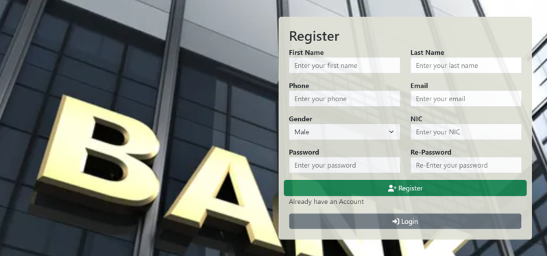
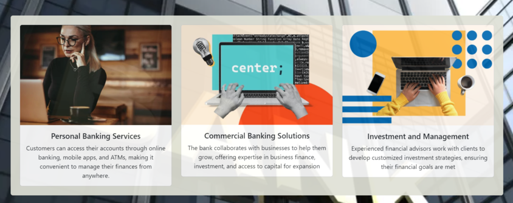

<h1 align="center">
   
  Banking Web App
   
</h1>

<h4 align="center">Create client and server folder inside the banking_webapp.</h4>

  
  
  
  
  
   

# Description

## Steps to Initialize the Project

### create client and server folder inside the banking_webapp

1. server side -
    - cd ./banking_webapp/server
    - npm install
    - npm install express mongoose cors nodemon
    - create new file inside server "index.js"
    - update "package.json" with below to refresh the "index.js" file via nodemon
        "scripts": {
            "start": "nodemon index.js"
        }
    - make sure to adjust the port in listening (port:3000) accordingly
    - npm start
    - create models directory and .js files according to the tables inside the database

2. database side -
    - download mongodb compass to your OS
    - add the mongodb extension to your vs code
    - connect the database with connection link
    - when using localhost adjust it with 127.0.0.1 for best practice
    - create new database in compass
    

3. client side - 
    - cd ./banking_webapp/client
    - npm install
    - npm install bootsrap react-router-dom
    - npm start
  

